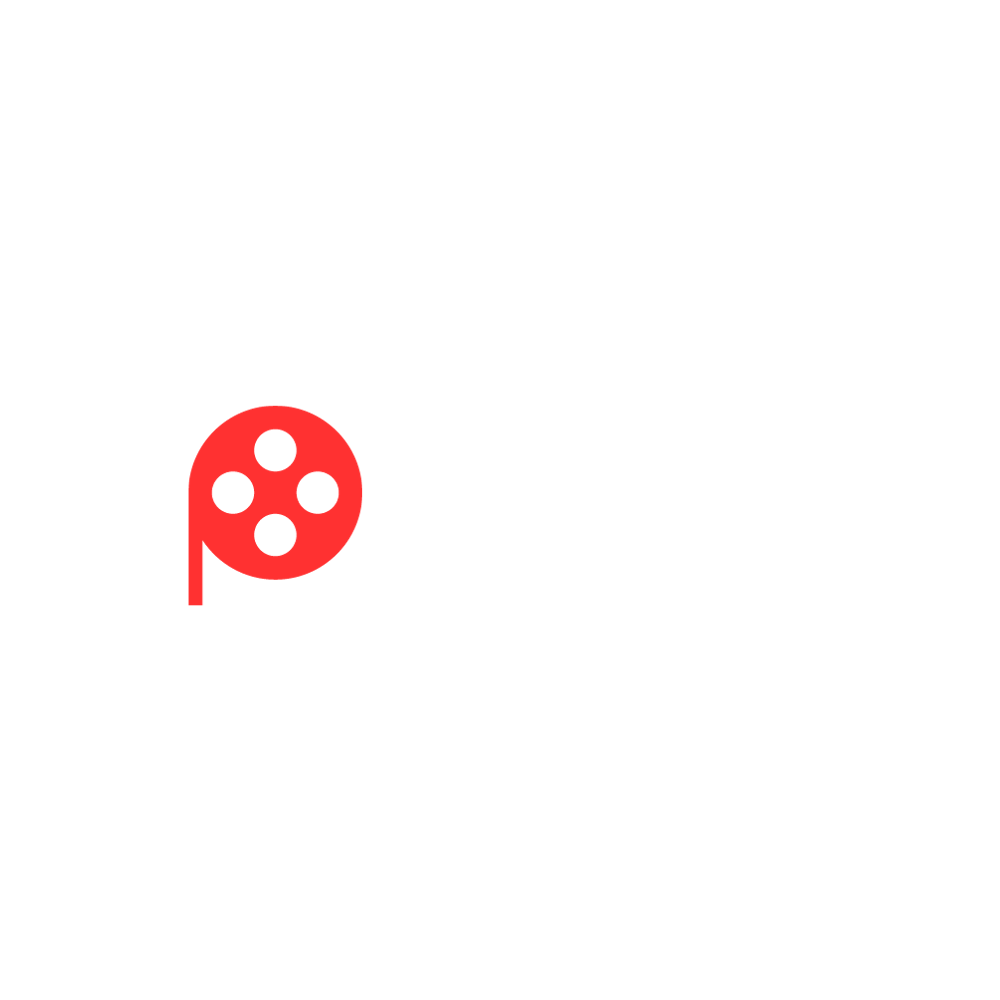

<p align="center"><a href="#" target="_blank"></a></p>

# FilmSphere
## Project Overview
FilmSphere is a web application developed as part of a school project, designed to cater to movie enthusiasts. It provides extensive details about movies, including cast and crew information, reviews, and user ratings. Users can browse movies, manage personal watchlists, and interact with content dynamically. Built with **Laravel**, FilmSphere offers a responsive and interactive user experience. This project is released under the MIT license. **Please note that while the code can be freely used and modified, I do not take responsibility for any repercussions of its reuse.**

## Local Environment Setup
### Prerequisites
* Docker
* Composer
* Node.js and npm

### Steps
1. Clone the repository:
    ```Bash
    git clone https://github.com/TheFakeHamma/imdb-clone-school-project.git
    cd imdb-clone-school-project
    ```

2. Set up environment variables:
    * Copy the `.env.example`file to `.env`:
        ```bash
        cp .env.example .env
        ```
    * Generate an application key:
        ```bash
        php artisan key:generate
        ```
    * Update the `.env`file to match your local database and other services configurations.

3. Start the Docker containers:
    * Build and run the Docker containers using `docker-compose`for development:
        ```bash
        docker-compose -f docker-compose.dev.yml up --build
        ```
    * This command starts all the necessary services defined in your `docker-compose.dev.yml`file, including your app's server, database, and any other services like MailHog for mail catching.

4. Run database migrations and seeders:
    * After the containers are up, run:
        ```bash
        php artisan migrate --seed
        ```
    * This command will set up your database schema and populate it with any initial data needed for the application.

5. Access the application:
    * The application will be available at `http://localhost:8000` (or another port specified in your `docker-compose.dev.yml`).

## Deployment
The application is deployed on Railway. It uses configurations tailored for Railway to ensure optimal performance and stability. The deployment process is managed through the Railway dashboard, where environment variables and other deployment settings are configured.

## Live Application
Visit the live application at [FilmSphere](https://imdb-clone-school-project-production.up.railway.app/).

Feel free to explore the repository for more details on project setup and usage. If you need any assistance, please refer to online documentation for Laravel or consult community forums and resources.